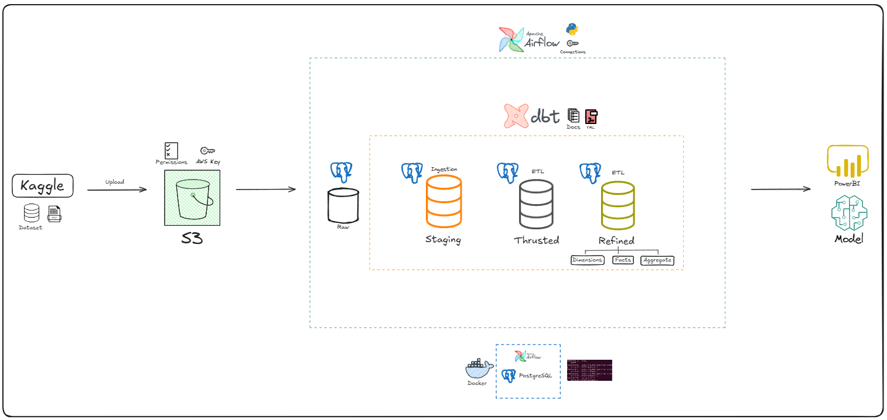

# E-commerce Lakehouse Project

- README em [Português](README.pt-br.md).

## 📌 Overview

**Lakehouse** project for e-commerce using a dataset from Kaggle.  
The workflow includes data ingestion, transformation, and availability using **AWS S3**, **PostgreSQL**, **Apache Airflow**, and **dbt**.  
The environment was hosted **locally** on a Linux virtual machine created with **Oracle VirtualBox**, ensuring isolation, portability, and full control over the infrastructure.  
The architecture follows the **Medallion** pattern (Staging, Trusted, and Refined), ensuring organized, clean, and ready-to-use data for advanced analytics and BI visualizations.

## ⚙️ Technologies

- **AWS S3** – Raw data storage.
- **Docker** – Hosting PostgreSQL and Apache Airflow services.
- **PostgreSQL** – Relational database.
- **Apache Airflow** – Pipeline orchestration.
- **dbt** – Data transformations, documentation, and testing.

## 🚀 Workflow

1. **Ingestion:** Upload Kaggle data to S3 and load into PostgreSQL via Airflow.
2. **Transformation:** Data modeling and cleaning with dbt, creating the Staging, Trusted, and Refined layers.
3. **Availability:** Data ready for analysis in tools like Power BI or Machine Learning models.

## 📊 Dataset

- Source: [Brazilian E-Commerce Public Dataset by Olist](https://www.kaggle.com/datasets/olistbr/brazilian-ecommerce/)
- Includes orders, customers, products, payments, and reviews.

## 🏛️ Project Architecture

