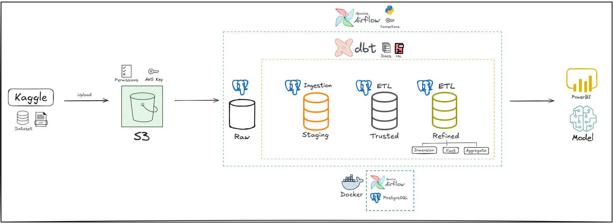

# E-commerce Lakehouse Project

- README in [English](README.md).

## 📌 Visão Geral

Projeto de **Lakehouse** para e-commerce utilizando um dataset do Kaggle.
O fluxo inclui ingestão, transformação e disponibilização de dados usando **AWS S3**, **PostgreSQL**, **Apache Airflow** e **dbt**.
O ambiente foi hospedado **localmente** em uma máquina virtual Linux criada no **Oracle VirtualBox**, garantindo isolamento, portabilidade e controle total sobre a infraestrutura.  
A arquitetura segue o padrão **Medallion** (Staging, Trusted e Refined), garantindo dados organizados, limpos e prontos para análises avançadas e visualizações em ferramentas de BI.

## ⚙️ Tecnologias

- **AWS S3** – Armazenamento de dados brutos.
- **Docker** – Hospedagem dos serviços PostgreSQL e Apache Airflow.
- **PostgreSQL** – Banco de dados relacional.
- **Apache Airflow** – Orquestração das pipelines.
- **dbt** – Transformações, documentação e testes.

## 🚀 Fluxo

1. **Ingestão:** Upload dos dados do Kaggle para o S3 e carregamento no PostgreSQL via Airflow.
2. **Transformação:** Modelagem e limpeza com dbt, criando as camadas Staging, Trusted e Refined.
3. **Disponibilização:** Dados prontos para análise em ferramentas como Power BI ou modelos de Machine Learning.

## 📊 Dataset

- Fonte: [Brazilian E-Commerce Public Dataset by Olist](https://www.kaggle.com/datasets/olistbr/brazilian-ecommerce/)
- Inclui pedidos, clientes, produtos, pagamentos e avaliações.

## 🏛️ Arquitetura do Projeto

